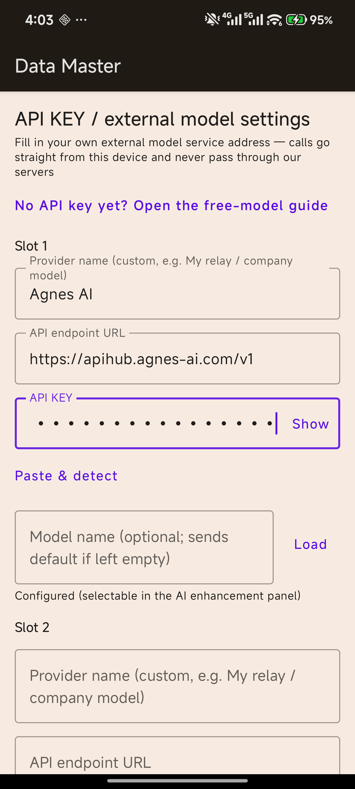

# Data Master — On-Device Data Cleaning Engine for Android

**Pick a CSV / XLSX / XLSM / JSON file, apply built-in cleaning rules, preview the result, export. Base cleaning runs fully on-device — your file content never leaves the phone. An optional AI enhancement mode (off by default) lets you connect your own external model endpoint and ask for help with your data.**

Data Master is a focused Android utility for people who work with messy tabular data — accountants and bookkeepers normalizing exported ledgers, analysts prepping CSVs before they hit a spreadsheet, ops teams fixing date/currency columns in bulk, students cleaning datasets for coursework.

> **Repository status.** This repository is a **portfolio / showcase** for the Data Master project: documentation and screenshots of the commercial build. **No binaries and no source code are published here.** The commercial Android app is sold directly via [Gumroad](https://gumroad.com) as a one-time purchase; this showcase intentionally ships no APK because the paid app is an online-licensed product (activation touches a licensing server, optional AI calls go to your own model endpoint), and publishing any build would expose the commercial activation protocol. Every capability claim below is what the app actually does on a real device — no store-listing hype, no fabricated screenshots.

## What it does

- **Local cleaning engine** — normalize date formats (including `YYYY年MM月DD日` / `2026/10/01` / `01-10-2026` variants), convert Chinese financial units (`万元` / `亿元` → plain numbers), repair boolean values, mark missing/no-data sentinels (`异常` / `无` / blank), guard against CSV formula injection, bound import size and reclaim cache — all computed on the device.
- **Four formats in, one export flow** — CSV, XLSX, XLSM and JSON import; cleaned output exported through the Android share/SAF flow.
- **Preview before you commit** — every rule change is reflected in an on-screen preview of the cleaned rows before export.
- **Batch cleaning** — pick multiple files and run them through the same rule set.
- **Paste-text cleaning** — paste raw tabular text and clean it without creating a file.
- **Custom cleaning rules (paid)** — build and save your own rule set beyond the built-ins.
- **Cleaning history** — the last 30 runs, kept on-device.
- **Optional AI enhancement (default off)** — bring your own key: point the app at any OpenAI-compatible model endpoint (provider, URL, key, optional model name). Calls go **straight from your device to your endpoint** and never pass through our servers. Includes *Paste & detect* (paste an endpoint URL and let the app extract the fields), model-list dropdown, and a free-model guide.

## Screenshots

| API key / external model settings |
|---|
|  |

*(Screenshot from the current English build, v2.4.x.)*

## Free vs Paid (straight talk)

| | Free | Paid |
|---|---|---|
| Local cleaning tier | up to **5 MB** per file | up to **10 MB** per file |
| Files over your tier limit | guided to the web-based cloud cleaning service (upload leaves the device) | same |
| Built-in rules / batch / paste / history | ✅ | ✅ |
| Custom cleaning rules | 🔒 locked | ✅ unlocked |
| AI enhancement (BYOK) | ✅ selectable | ✅ |
| Price | $0 | one-time license (Gumroad) |

- The free quota is counted **on-device per install**; it is an honest courtesy, not an anti-fraud system (Android IDs can be reset by factory reset / multi-user / signature changes).
- The web fallback for oversized files is the publisher's cloud service (AI-Congress-Online); the app itself takes **no cut** — it is a referral, not a paywall.

## Activation & licensing

Data Master is a paid app (one-time purchase, no subscription). A **license key** unlocks the paid tier (higher local tier + custom rules). Keys are issued per purchase and validated on-device, with an online fallback so the same key works across reinstalls. We keep the price low and ask you to play fair; like any software, a determined reverse-engineer could defeat it, which is exactly why the commercial build is **not** published in this repository.

## Privacy

Honest disclosure, per-screen:

- **Base cleaning is fully local.** Your file content does **not** leave the device for any built-in cleaning operation.
- **Files over your tier limit** are offered a web-based cloud cleaning path — choosing it **uploads the file** to the publisher's web service; the dialog says so explicitly before you tap.
- **Optional AI enhancement** sends your pasted/selected data to **your own configured model endpoint**; the app tells you this in the AI panel before the first call.
- **Rewarded ads and optional AI calls use the network.** Cleaning and export never require it.
- Everything else (rules, history, activation state) stays on-device.

## Building / provenance

- Version lineage and release hashes are maintained in the publisher's private release ledger (SHA-256 pinned per artifact); see [docs/RELEASE-NOTES.md](docs/RELEASE-NOTES.md) for the public summary.
- Current commercial build: **v2.4.2** (English UI, R8-obfuscated, certificate CN=DataMaster). Distributed via Gumroad; there is no Play Store listing.

## License

Evaluation license — see [LICENSE](LICENSE). This repository is a showcase: documentation and screenshots may be referenced for portfolio purposes; **commercial redistribution of any artifact is not permitted**. The commercial app is sold separately via Gumroad.

## Disclaimer

Data Master cleans data the way its rules say it does — it is a data-processing tool, **not** a guarantee of correctness for your downstream reports. Always spot-check cleaned output before using it in anything that matters. Cloud cleaning and AI assistance are optional conveniences; verify their output the same way.